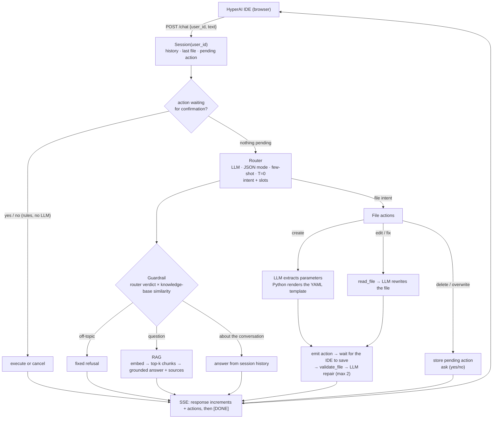

# Hyperion — agentic assistant for the HyperAI IDE

> Veles Hack 2026 · Challenge 1 · HYPER-AI — Eclipse Foundation · Riding the Edge-to-Cloud Continuum · Valencia, 6–8 Oct 2026

Hyperion is a FastAPI microservice that the [HyperAI IDE](https://ide.hyperai.di.uoa.gr/) talks to.
It answers questions about HYPER-AI from the project documentation, and turns plain-language
requests into IDE actions: it writes application descriptors, validates them, fixes them, and asks
before it deletes anything.

```bash
docker run --rm -p 8000:8000 -e API_KEY=<legion1 key> starchhh/hyperion:latest
```

The image is multi-arch (`linux/amd64` and `linux/arm64`), so the same tag runs on x86 servers and
Apple Silicon.

## What it does

| Challenge criterion | How Hyperion meets it |
|---|---|
| Working microservice | `POST :8000/chat` streams Server-Sent Events: text increments and IDE actions |
| Natural language → IDE actions | create / edit / delete files and folders, validate and read files |
| Guardrails | off-topic requests get a fixed refusal; the verdict is cross-checked against the knowledge base |
| RAG | answers come only from retrieved excerpts of `knowledge/`, with the source documents listed |
| Memory | per-`user_id` history, last file and created files; follow-ups like "change the memory to 2Gi" work |
| Human in the loop | delete and overwrite wait for an explicit "yes" |

## Demo

A real session (text is what the chat shows; `[...]` marks the action the IDE executes):

```text
> What are Open Connectors?
The Open Connectors are an open-source project designed to orchestrate and manage edge devices
using a Kubernetes-powered control plane, implementing an abstraction layer between a Kubernetes
cluster and resources that cannot natively execute containers. ...
Sources: Open Connectors (D4.2) - 3.1 High-Level Architecture; Open Connectors (D4.2) - 2.1 Overview

> What is the weather today?
Sorry, I can only help with HyperAI: questions about the platform and its documentation, and
creating, editing, validating or deleting files in your IDE workspace.

> Create a deployment YAML for a service using the nginx Docker image
Creating nginx.yaml - a native application profile for nginx:latest.
  [create_file nginx.yaml]
Validating with the IDE... passed.

> Change the memory to 2Gi
Working on nginx.yaml... done:
  - memory: "1Gi"
  + memory: "2Gi"
  [edit_file nginx.yaml]
Validating with the IDE... passed.

> Delete it
Delete nginx.yaml? (yes/no)

> yes
  [delete_file nginx.yaml]
Deleted nginx.yaml.
```

<!-- TODO: demo GIF recorded in the IDE -->

## Architecture

The model on the hackathon server is Llama 3.1 **8B** with an 8k context. A model that size is not
reliable at open-ended multi-step tool use, so Hyperion is a **deterministic pipeline**: Python owns
the control flow and the LLM does narrow, well-specified jobs.



Design decisions worth knowing:

- **New descriptors are valid by construction.** The LLM only extracts parameters (image, tag, port,
  cpu, memory, workload kind…). Python normalises them (`8GB` → `8Gi`, "half a core" → `500m`) and
  renders the native profile or device manifest (Docker, Android APK, ESP32) from a template.
- **The IDE validator is the judge.** After every write the agent waits until the IDE has saved the
  file, calls `validate_file`, and feeds reported errors back to the LLM for repair, at most twice.
- **Nothing the model invents is acted on.** A path from the router, or a value from parameter
  extraction, is only used if the user actually wrote it (or it is a file this session created).
  The 8B model otherwise makes up file names and copies values from its few-shot examples.
- **Confirmation is rule-based.** Only an unambiguous, whole-message agreement executes a pending
  delete or overwrite; "yes, but…" or any other reply drops it.
- **Sources are appended by code**, from the retrieval scores, not written by the model.
- **Plain-text replies.** The IDE chat does not render Markdown, so markup is stripped.

```
main.py              FastAPI app: /chat, /health, SSE, the pipeline
helpers.py           starter helpers: read_file, validate_file
hyperion/
  llm.py             chat / JSON / embedding clients for legion1, plain-text streaming
  session.py         in-memory state per user_id
  router.py          intent + slot extraction
  guardrails.py      off-topic detection
  rag.py             chunking, embedding index, retrieval, source selection
  yamlgen.py         parameter extraction, YAML templates, edit and repair passes
  fileops.py         handlers for the file intents, validate-and-repair loop
  confirm.py         yes/no classification, pending actions
  actions.py         action events, path sanitisation
  ide.py             read-only client for the IDE backend
  prompts.py         every prompt and fixed reply
knowledge/           RAG corpus: HYPER-AI deliverables + IDE tutorial pages
scripts/             fetch_docs, eval_router, eval_rag, ide_sim
tests/               pytest suite (no network needed) + acceptance prompts
```

## Run it

```bash
cp .env.example .env            # paste the team API_KEY into .env (never commit it)
uv run python -m hyperion.rag   # embed knowledge/ into .cache/index.npz (once, and after editing knowledge/)

uv run main.py                  # local, agent on :8000
docker compose up --build       # or in Docker; the image ships the index
```

The IDE, for trying it in the browser (on Apple Silicon add `--platform linux/amd64`):

```bash
docker run --rm -p 3001:3001 -e AUTH_ENABLED=false --name ide-backend donmichael/ide-backend:latest
docker run --rm -p 5000:80 --name ide-gui donmichael/ide-gui:latest
# open http://localhost:5000 → Hyperion (robot icon)
```

On macOS port 5000 is usually taken by AirPlay Receiver; use `-p 5050:80` and open
`http://localhost:5050` instead. The IDE always calls the agent at `http://localhost:8000/chat`.

Without a browser:

```bash
curl -N -X POST localhost:8000/chat -H 'Content-Type: application/json' \
  -d '{"user_id":"123e4567-e89b-12d3-a456-426614174000","text":"What is HyperAI?"}'

# plays the IDE: prints the reply and applies the actions to the local ide-backend
uv run python scripts/ide_sim.py "Create a deployment YAML for nginx" "Change the memory to 2Gi"
```

Publishing the multi-arch image:

```bash
uv run python -m hyperion.rag
docker buildx build --platform linux/amd64,linux/arm64 -t <dockerhub-user>/hyperion:latest --push .
```

The API key is never baked into the image; it is injected at runtime (`-e API_KEY=...` or
`env_file`). Without it the service still starts and `/health` answers, and every chat replies with
a configuration error naming `API_KEY`; a key the server rejects gets its own message.

**Reaching the IDE backend from the container.** `host.docker.internal` exists on Docker Desktop
(macOS, Windows) but not on Linux unless the container is started with
`--add-host host.docker.internal:host-gateway`. Hyperion therefore probes several addresses at
startup - `IDE_BACKEND_URL`, `host.docker.internal`, the container's default gateway and
`localhost` - and uses the first one where the backend answers, so a plain `docker run` works on
Linux too. If the backend lives somewhere else, set `IDE_BACKEND_URL`.

Configuration (environment variables): `API_KEY` (required for LLM calls), `IDE_BACKEND_URL`
(default `http://localhost:3001/api`, `http://host.docker.internal:3001/api` in the image),
`IDE_APPLY_TIMEOUT` (seconds to wait for the IDE to save a file before skipping validation, default 4).

## Protocol

Request: `{"user_id": "<uuid>", "text": "<user message>"}`. Response: `text/event-stream`, each
event `data: <json>\n\n`, ending with `data: [DONE]`:

```
data: {"response": "incremental text chunk"}
data: {"action": "create_file", "path": "demo/nginx.yaml", "content": "..."}
data: [DONE]
```

Actions: `create_folder`, `delete_folder`, `create_file`, `edit_file`, `delete_file`. Paths are
always relative to the workspace; absolute paths and `..` are refused.

## Tests

```bash
uv run pytest                           # unit tests, no network
uv run python scripts/eval_router.py    # router vs. the live model on held-out phrasings
uv run python scripts/eval_rag.py       # retrieval scores, used to pick the thresholds
```

`tests/acceptance.md` lists the prompts to run in the IDE before every push.

## Known limits

- Sessions live in memory: history and pending confirmations are lost when the container restarts,
  and only the last 6 turns are kept.
- The IDE backend has no "list files" endpoint for agents, so Hyperion only knows the files it
  created or was asked about in the session.
- Answers are limited to what is in `knowledge/`; anything else gets "I don't know".
- Confirmation words are English (plus a few common yes/no words in other languages).

## License

[Apache 2.0](LICENCE)
